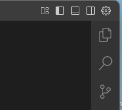
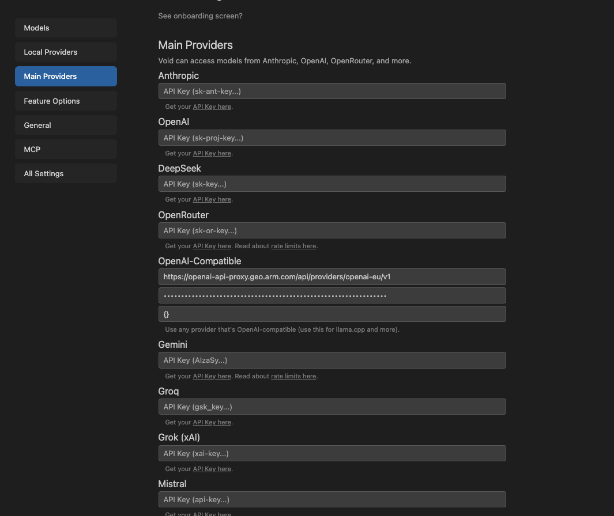
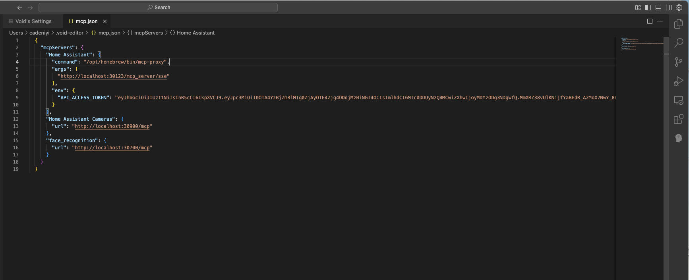
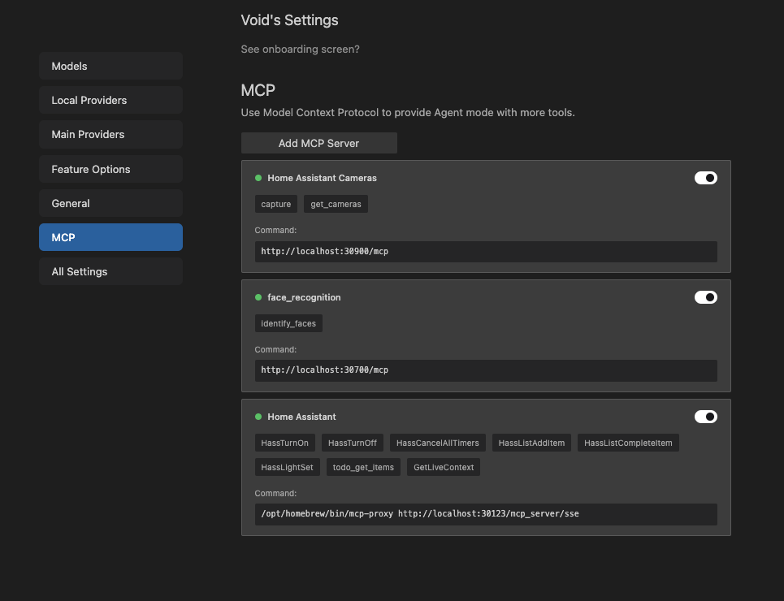

# Running the demo on the emulated system on macOS

## Prerequisites

### Connection to Arm Network

Either directly or via VPN.


### QEMU

Can be installed using brew:

  `brew install qemu`

### Kubernetes

Included with docker desktop. Kubernetes does not need to be enabled within docker desktop.

### mcp-proxy

Can be installed using brew

```
brew install mcp-proxy
```


## Download the Release

* Download the release file:

  `wget https://gitlab.arm.com/api/v4/projects/576/packages/generic/rimdworkspace/Q2_2025_4/rimdworkspace.tar.gz`

* Untar:

  `tar xf rimdworkspace.tar.gz`

* Change directory into the release directory:

  `cd rimdworkspace_Q2_2025_4`


##  Start the keyserver

  ```
  cd keyserver
  ./keyserver_arm64_macos > keyserver.log 2>&1  &
  cd ..
  ```


## Start the virtual machines 

  `bash ./setup_vms.sh`
  
  This will take a few minutes to finish. 
  
  The `host.log` file contains the console output from the host VM.
  
  The `isolated.log` file contains the console output from the isolated VM (our AI Enclave).
 

  It is possible to ssh into the host vm using: `ssh -p 5555 hailhydra@127.0.0.1`

  It is possible to ssh into the isolated VM using: `ssh -i id_ed25519 -p 5556 root@127.0.0.1`
  
 
 
 
  
## Set KUBECONFIG 

Set the KUBECONFIG environment variable (in your terminal on your Mac) to point to the k3s.yaml file copied from the host VM:

`export KUBECONFIG=$(pwd)/k3s.yaml`


Check:

```
kubectl get nodes

NAME      STATUS   ROLES                  AGE   VERSION
hydravm   Ready    control-plane,master   18m   v1.32.6+k3s1
```


## Deploy the first part of the demo

Run the `up` script:

```
cd demo
./up
```

This deploys the Home Assistant and mosquitto MQTT server containers. The containers execute within the host VM.
It may take 2-3 minutes for everything to come up.

Check the status and wait for all 3 pods to be running.

```
kubectl get pods

NAME                            READY   STATUS    RESTARTS   AGE
data-d5896d5bc-vk256            1/1     Running   0          2m23s
homeassistant-99c85958c-c8rkg   1/1     Running   0          2m23s
mosquitto-6d6859fc64-hp4kx      1/1     Running   0          2m23s
```

You should now be able to interact with the HomeAssistant instance via the GUI: [http://localhost:30123](http://localhost:30123) with username: vm-user and password:vm-user


## Deploy the second part of the demo

Run the `face_up` script

```
./face_up
```

This deploys the containers for the MCP servers and the Milvus vector database. These containers also run within the host VM.
The Triton inference server is also deployed ***but to the isolated VM.***

It will take a few minutes for all the pods to be deployed. This could be 5-15 minutes depending on the speed of your network connection. 

Wait for all pods to be running (or Completed)

```
kubectl get pods
NAME                                 READY   STATUS      RESTARTS   AGE
data-d5896d5bc-vk256                 1/1     Running     0          3h22m
face-mcp-757cfb7667-lxlnc            1/1     Running     0          11m
ha-camera-mcp-6bdddd764d-p4kbk       1/1     Running     0          11m
homeassistant-99c85958c-c8rkg        1/1     Running     0          3h22m
milvus-deployment-857b89cd68-fcff2   1/1     Running     0          11m
mosquitto-6d6859fc64-hp4kx           1/1     Running     0          3h22m
populate-kr9sf                       0/1     Completed   0          11m
triton-inference-6d465dc47-dxx6z     1/1     Running     0          6m3s
```

## Configuring the AI Agent to use the MCP Servers


An example file in the `demo` directory `mcp.json` shows how to configure an LLM-enabled IDE to connect to the MCP servers in the demo.
The instructions below use Void, an open-source alternative to Cursor. We also use the ARM OpenAI proxy to access the gpt-4.1 model.


### Obtain an API Key

Visit: [https://openai-api-proxy.geo.arm.com](https://openai-api-proxy.geo.arm.com). Use the "Generate New API Key" Button (the location should be automatically set for your current location).
Copy and save the API key because once generated, your API key will only be shown once and cannot be retrieved again. Generating a new key will disable your old one.


### Download and install Void via [https://voideditor.com](https://voideditor.com)

Download for Mac


### Run Void

Use the following command in a terminal to run Void:

`NODE_TLS_REJECT_UNAUTHORIZED=0 /Applications/Void.app/Contents/MacOS/Electron > /dev/null &`

### Configure Void

Use the Gear Symbol in the top right corner to open the "Void's Settings" pane.



#### Add OpenAI Proxy

Click on Main Providers and add your OpenAI Proxy API key in the "OpenAI Compatible" section. 

Use `https://openai-api-proxy.geo.arm.com/api/providers/openai-eu/v1` as the Base URL.

You will then need to add a model - use `gpt-4.1` or `o4-mini`


 


#### Add MCP Configuration 

Click on "MCP" in the Settings Pane and then click on "Add MCP Server". This will bring up a new pane containing "mcp.json". Replace the contents with that from the `demo/mcp.json` file. Save the edited mcp.json file. T


>Note: the "command" field for HomeAssisant should be the full pathname to the `mcp-proxy` binary on your Mac




When you return to the "Void's Settings" pane the three MCP Servers should be available.




### Test

Start a new chat with Shift-Command-P  and "Chat Focus on View"

You can now create prompts that the LLM can use the tools provided by the MCP Servers to answer.

For example: Who is at my front door?

The LLM should ask for approval to run a tool. You can enable auto-approval for MCP Tools.

Depending on the model, you may have to ask it explicitly to recapture images from the camera.
 


